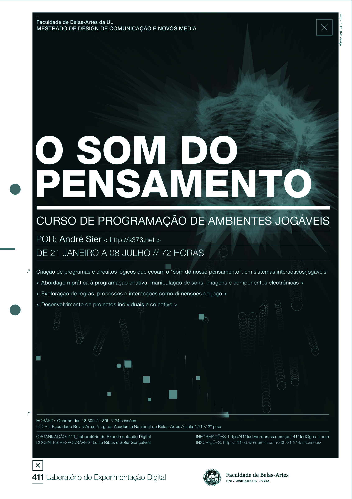
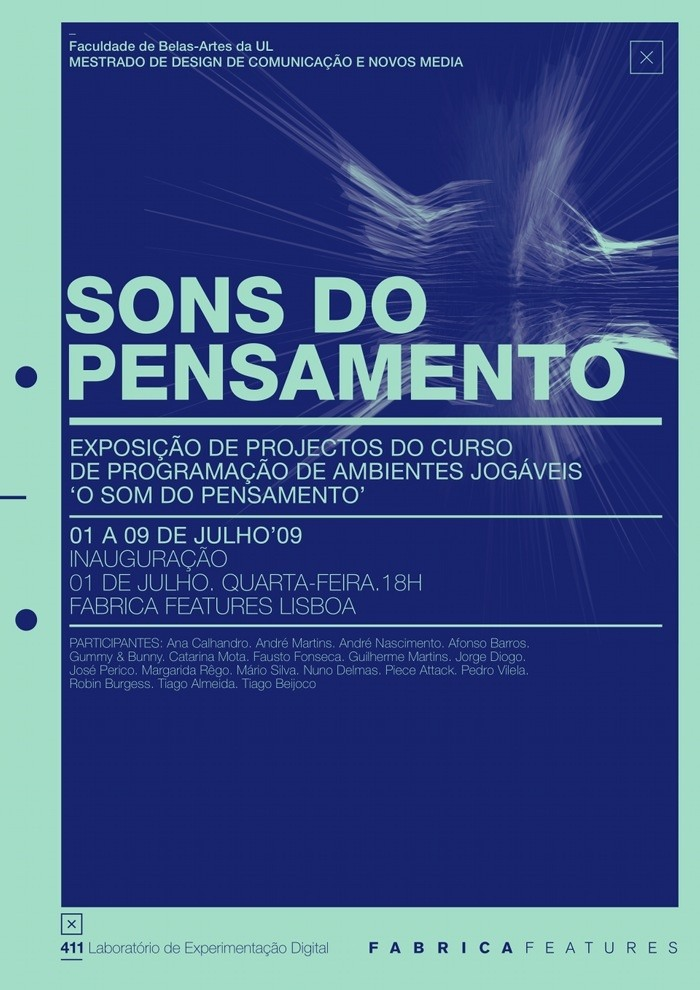

# _o_som_do_pensamento_fbaul_2009_

Curso de programação de ambientes jogáveis. Criação de programas e circuitos lógicos que ecoam "o som do nosso pensamento", em sistemas interactivos/jogáveis. Abordagem prática à programação criativa, manipulação de sons, imagens e componentes electrónicas. Exploração de regras, processos e interacções como dimensões do jogo. Desenvolvimento de projectos individuais e colectivo. 

# blog do curso
https://osomdopensamento.wordpress.com/

  

# exposição fábrica features

  

folha de sala exposição sons do pensamento

[folha de sala exposição sons do pensamento](_o_som_do_pensamento_2009/media/osomdopensamento_julho2009/_expo_fabrica/_2print/desd_SSP.pdf)
